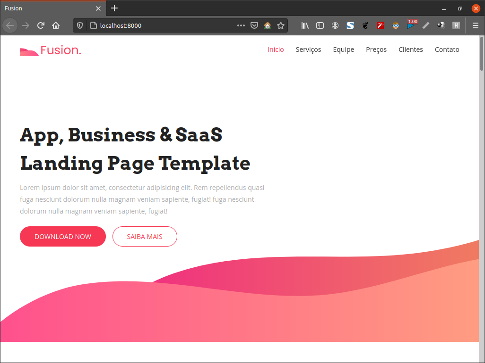

# Django3 - Site institucional com admin


template: https://uideck.com/templates/fusion-app-business-saas-product-landing-page-template/
desenvolvido durante o treinamento: https://www.udemy.com/course/programacao-web-com-django-framework-do-basico-ao-avancado/learn/lecture/15591504


## Dependências

-[poetry](https://python-poetry.org/)

## Run?

Instalar Dependências

```
$ poetry install
```

Criar/atualizar base e estrutura de dados

```
$ poetry run python manage.py migrate
```

Criar o super user de admin

```
$ poetry run python manage.py createsuperuser
```

Rodar o server local

```
$ poetry run python manage.py runserver
```

Estará disponível em `http://127.0.0.1:8000/`

Admin em `http://127.0.0.1:8000/admin`
